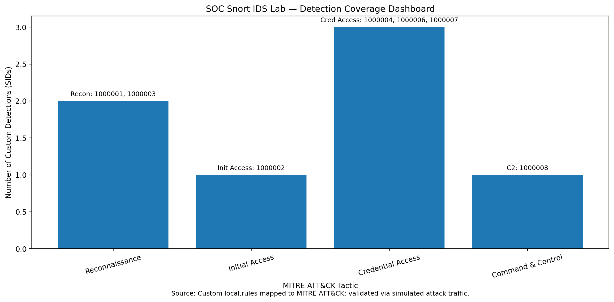

# Detection Coverage Matrix

This document maps custom Snort detection rules to MITRE ATT&CK techniques to demonstrate coverage of simulated adversary behaviours within the SOC lab environment.

## Visual Coverage Summary

| Detection ID | Rule Name                | Attack Stage   | MITRE ATT&CK Technique | Description |
|--------------|--------------------------|--------------  |------------------------|-------------|
| 1000001      | ICMP Host Discovery | Reconnaissance | T1595 | Detects ICMP ping sweeps used to identify active hosts |
| 1000002      | Admin Panel Probe        | Initial Access | T1190 | Detects probing of exposed admin endpoints |
| 1000003      | SYN Port Scan            | Reconnaissance | T1046 | Detects TCP SYN scanning used for service discovery |
| 1000004      | Web Brute Force (Burst)  | Credential Access | T1110 | Detects rapid login attempts against web services |
| 1000006      | Web Brute Force (Low & Slow) | Credential Access | T1110 | Detects slow distributed credential attacks |
| 1000007      | Distributed Brute Force | Credential Access | T1110 | Detects high-volume login attempts targeting a server |
| 1000008      | Reverse Shell Outbound Connection | Command & Control | T1071 | Detects outbound reverse shell communication |

## Summary

The lab demonstrates detection capability across multiple phases of the attack lifecycle:

- Reconnaissance
- Initial Access
- Credential Access
- Command & Control

This provides realistic coverage of adversary behaviour observed in enterprise environments.