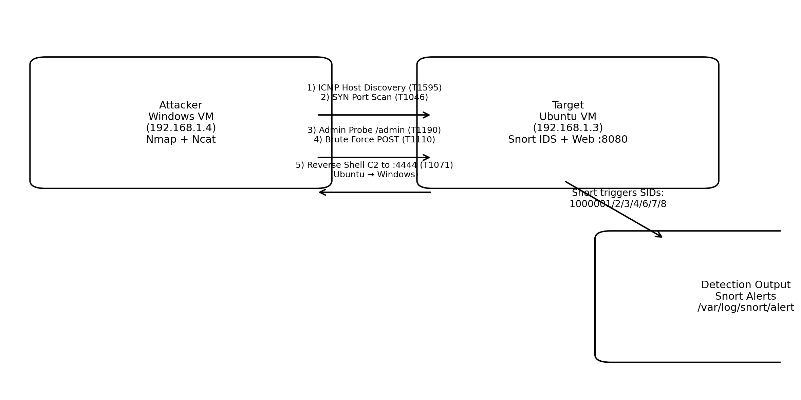

# Simulated Attack Chain

The lab simulates a multi-stage adversary attack against a target host monitored by Snort IDS.

## Visual Attack Chain

Attacker (Windows VM)
        |
        | 1. Ping Sweep
        v
Target Network
        |
        | 2. Port Scan
        v
Web Server (Python HTTP Server :8080)
        |
        | 3. Admin Panel Probe
        |
        | 4. Brute Force Login Attempts
        |
        | 5. Reverse Shell Connection
        v
Attacker Command & Control (Port 4444)

## Detection Points

Snort IDS detects attacker activity at multiple stages:

| Stage              | Detection                        |
| -----------------  | ---------------------------------|
| Host Discovery     | ICMP detection rule              |
| Port Scanning      | SYN scan detection               |
| Admin Access Probe | HTTP URI detection               |
| Credential Attack  | POST brute force detection       |
| Command & Control  | Reverse shell outbound detection |

These detections provide layered visibility into adversary activity across the attack lifecycle.
